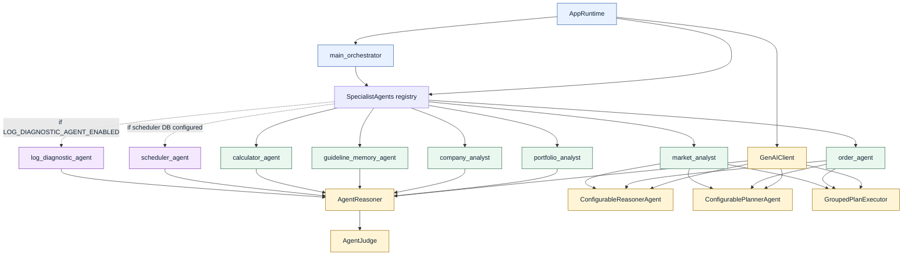
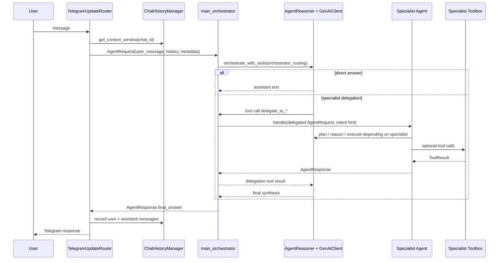
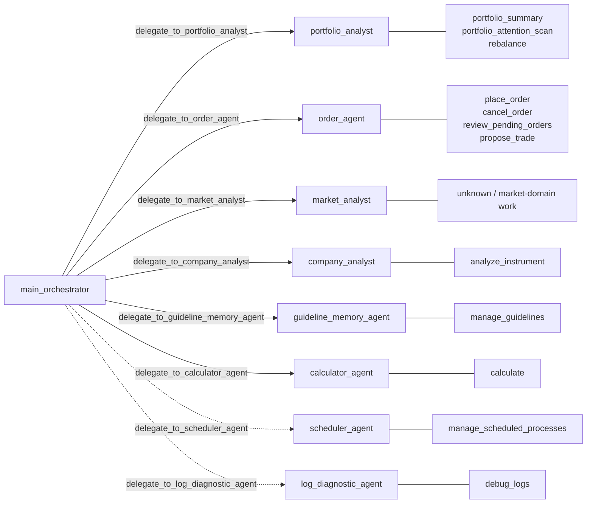
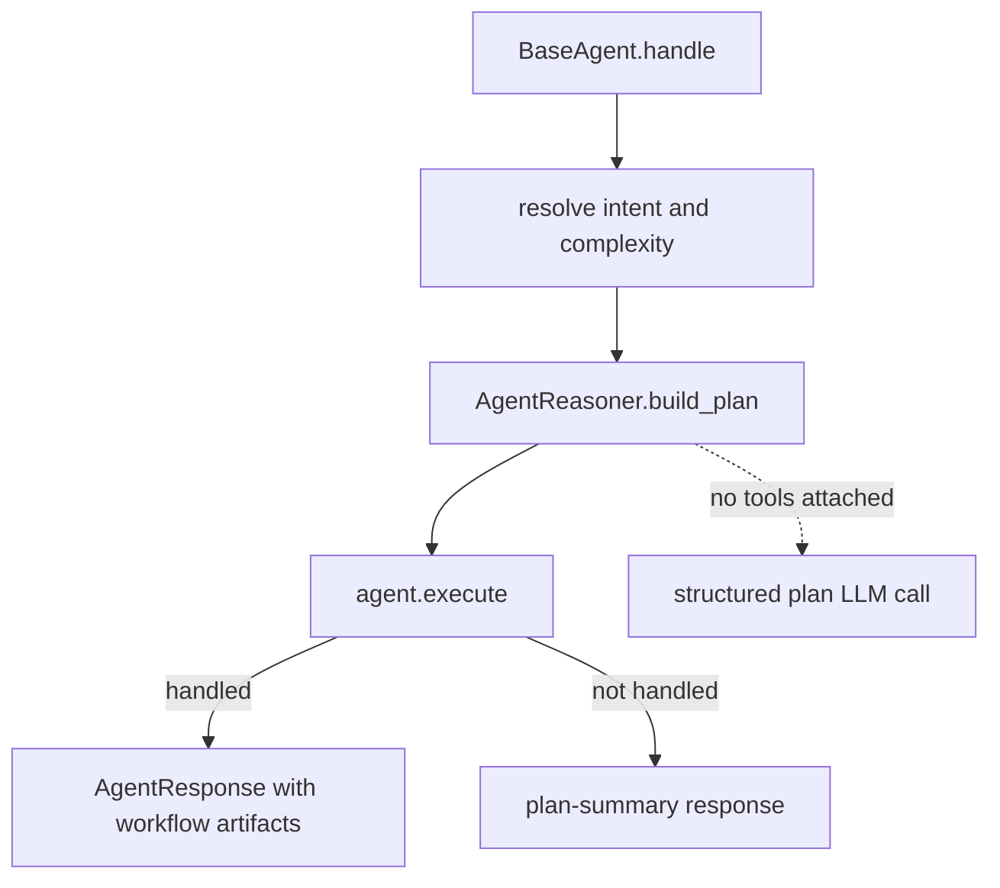
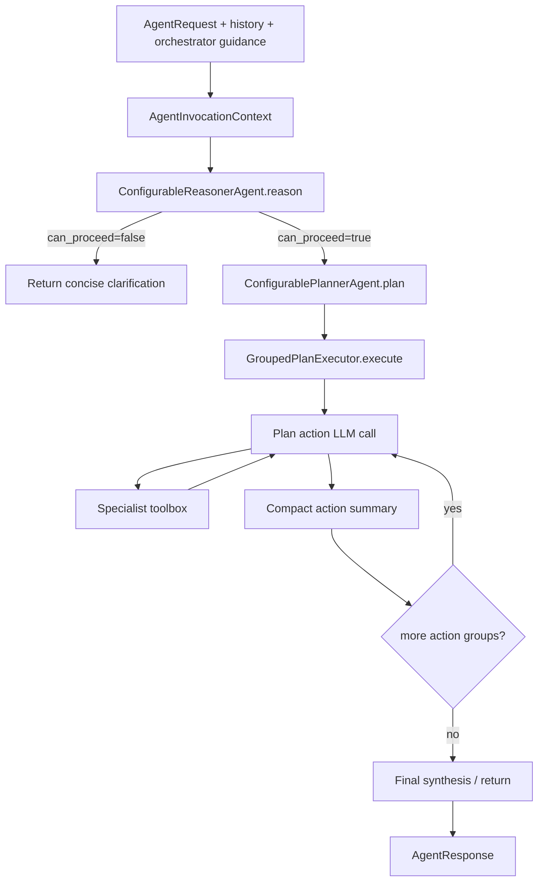
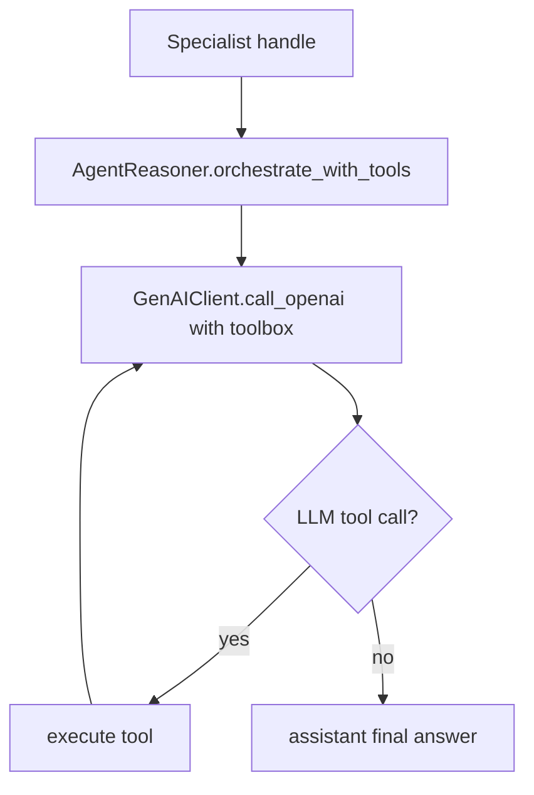
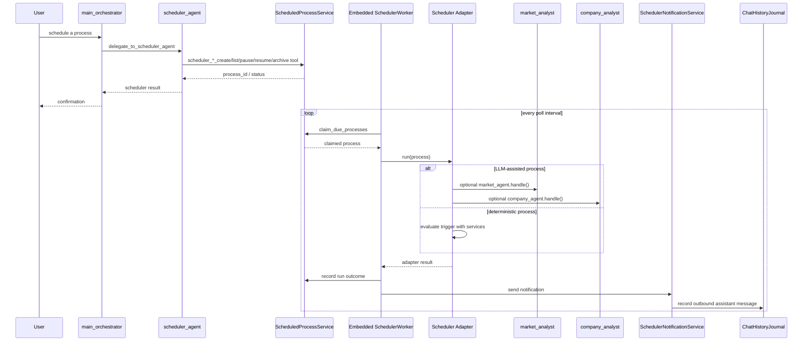
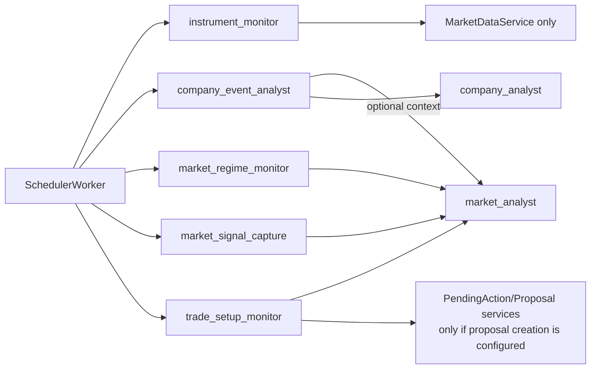
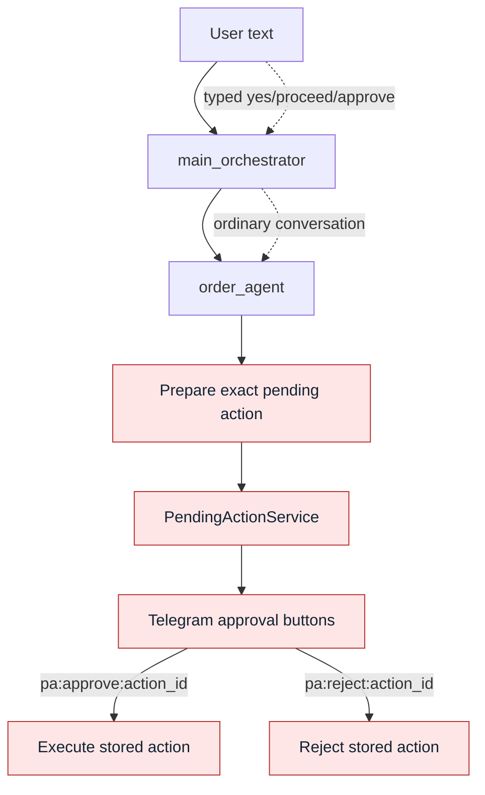
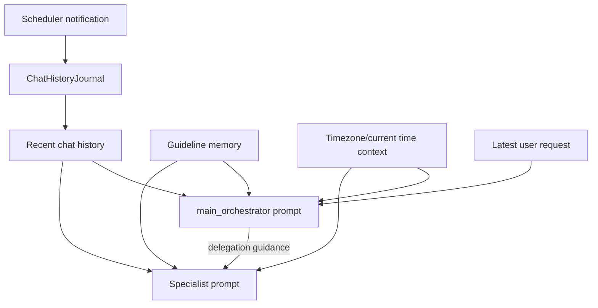

# Agent Interpolation Map

Status: current architecture overview for how agents invoke, wrap, and reuse one another.

This document is a visual map of the agent graph. It focuses on invocation
paths: who can call whom, through which boundary, and which flows pass through
the orchestrator versus app-managed processes such as the scheduler worker.

## Mental Model

```text
Telegram request
  -> chat history window
  -> main_orchestrator
  -> optional specialist delegation tool
  -> specialist-local flow
  -> final response
  -> chat history append

Scheduler worker tick
  -> due scheduled process
  -> scheduler adapter
  -> optional specialist agent call
  -> notification
  -> chat history append
```

The main rule is that normal user-facing agent work enters through
`main_orchestrator`. Scheduled processes are different: they are app-owned
workers that may call selected specialists directly because there is no new user
message to route.

## Runtime Agent Graph



Important distinction:

- `main_orchestrator`, `portfolio_analyst`, `order_agent`, `market_analyst`,
  `company_analyst`, `guideline_memory_agent`, `calculator_agent`,
  `scheduler_agent`, and `log_diagnostic_agent` are callable agents.
- `AgentReasoner`, `ConfigurableReasonerAgent`, `ConfigurablePlannerAgent`,
  `GroupedPlanExecutor`, and `AgentJudge` are shared agentic components. They
  are not normally delegated to by the orchestrator; specialists use them inside
  their own execution loops.

## Normal Telegram Request Flow



The orchestrator sees delegation as tool calls. Each delegation tool receives:

- `task_brief`
- `expected_output`
- `intent_kind`
- `entities`

The specialist receives the same current `AgentRequest`, plus
`orchestrator_guidance` derived from the delegation payload.

## Orchestrator Delegation Surface



Optional delegation tools only exist when the matching specialist exists:

- `delegate_to_scheduler_agent` requires a configured scheduled process service.
- `delegate_to_log_diagnostic_agent` requires
  `LOG_DIAGNOSTIC_AGENT_ENABLED=true` and a readable app log path.

## Invocation Matrix

| Caller | Invoked target | Boundary | Current purpose |
| --- | --- | --- | --- |
| `TelegramUpdateRouter` | `main_orchestrator` | Python method call with `AgentRequest` | User-facing request handling |
| `main_orchestrator` | specialists | LLM tool calls named `delegate_to_*` | Dynamic routing and final answer synthesis |
| `order_agent` | `ConfigurableReasonerAgent` | Python method call | No-tool broker-order reasoning context |
| `order_agent` | `ConfigurablePlannerAgent` | Python method call | Grouped broker-order action plan |
| `order_agent` | `GroupedPlanExecutor` | Python method call | Execute planned actions with broker toolbox |
| `market_analyst` | `ConfigurableReasonerAgent` | Python method call | No-tool market-analysis reasoning context |
| `market_analyst` | `ConfigurablePlannerAgent` | Python method call | Grouped market action plan |
| `market_analyst` | `GroupedPlanExecutor` | Python method call | Execute planned actions with market toolbox |
| `scheduler_agent` | scheduler management tools | LLM tool calls | Create/list/pause/resume/archive scheduled processes |
| `log_diagnostic_agent` | diagnostic log tools | LLM tool calls with cap | Read-only operational log investigation |
| `SchedulerWorker` | scheduler adapters | Python adapter registry | Run due scheduled processes |
| scheduler adapters | `market_analyst` / `company_analyst` | Direct specialist `handle()` call | Scheduled LLM-assisted analysis |
| `SchedulerNotificationService` | chat history journal | Python method call | Store scheduler outbound messages as assistant history |

## Specialist Internal Loops

### Base Specialist Loop

Most simple specialists inherit the base flow.



Used by:

- `portfolio_analyst` for portfolio summary workflow planning and execution
- `company_analyst` currently mostly as planning/profile response
- `guideline_memory_agent` with guideline-specific behavior
- fallback paths for specialists without a richer configured loop

### Configurable Agentic Loop

`market_analyst` and supported `order_agent` flows use the richer loop when the
runtime provides the shared components and the specialist has a toolbox.



Execution semantics:

- Reasoning and planning receive toolbox descriptions, but no tools.
- Execution attaches the specialist toolbox.
- Action groups run sequentially.
- Actions inside a parallel group may use parallel tool calls only for read-only,
  non-broker actions.
- Broker/state-changing work remains sequential and approval-gated.

### Tool-Orchestration Loop

Some specialists use direct tool-enabled orchestration rather than the grouped
reason/plan/execute loop.



Used by:

- `scheduler_agent` with private scheduler tools
- `log_diagnostic_agent` with read-only diagnostic log tools
- `market_analyst` fallback when the configurable loop is unavailable

## Scheduler Interpolation

The scheduler has two different roles:

1. `scheduler_agent` is a chat-invoked specialist that creates or manages
   scheduled process definitions.
2. `SchedulerWorker` is an app/runtime worker that periodically claims due jobs
   from the database and runs adapters.



Scheduler adapters currently call specialists directly rather than routing
through `main_orchestrator`, because a scheduled run is already scoped by its
stored process definition. The notification is still written into chat history
so the next user message gives the orchestrator the full conversation context.

## Scheduled Process To Agent Map



No scheduled process submits broker orders directly. Trade setup monitors may
prepare proposals/pending actions only when explicitly configured; future
execution still requires Telegram button approval.

## Approval And Side-Effect Boundary



Natural-language messages can request or revise a side effect. They do not
approve or reject a pending side effect. Approval and rejection happen through
Telegram callback payloads only.

## Context Interpolation



Every specialist receives the recent chat history from the request. Scheduler
notifications bypass the orchestrator at send time, but they are appended as
assistant history so later orchestrator turns can see them.

## Current Limitations To Keep Visible

- The full `reason -> plan -> execute -> judge -> return` loop is implemented
  only partially. `market_analyst` and key `order_agent` paths use the reusable
  reasoner, planner, and grouped executor; the judge step is not yet wired into
  that loop by default.
- `portfolio_analyst`, `company_analyst`, and some specialist fallback paths
  still use the older base `plan -> execute` shape.
- `scheduler_agent` and `log_diagnostic_agent` use bounded tool orchestration,
  not the grouped reason/plan executor.
- Scheduler worker invocations intentionally bypass the orchestrator, so they
  must keep writing outbound results to chat history for later context.
- Optional agents are absent from the orchestrator toolbox when their backing
  runtime components are unavailable.

## Reading The Graph

Use this map together with:

- [AGENTIC_FLOW.md](./AGENTIC_FLOW.md) for the target step model.
- [ARCHITECTURE_DIAGRAMS.md](./ARCHITECTURE_DIAGRAMS.md) for broader runtime
  architecture.
- [DEV_GUIDELINES.md](./DEV_GUIDELINES.md) for implementation rules and
  tracing/logging expectations.
