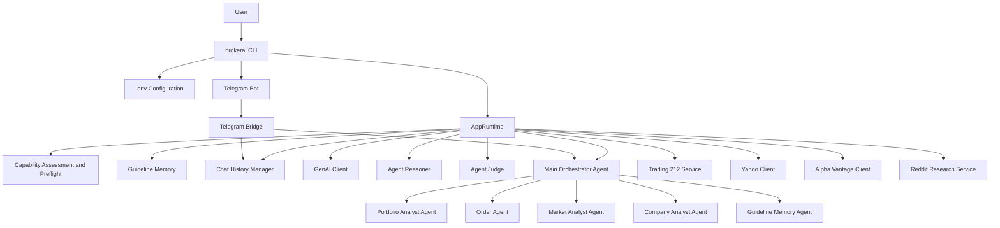
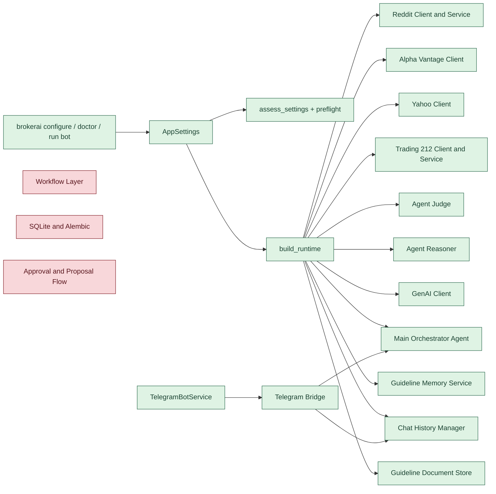
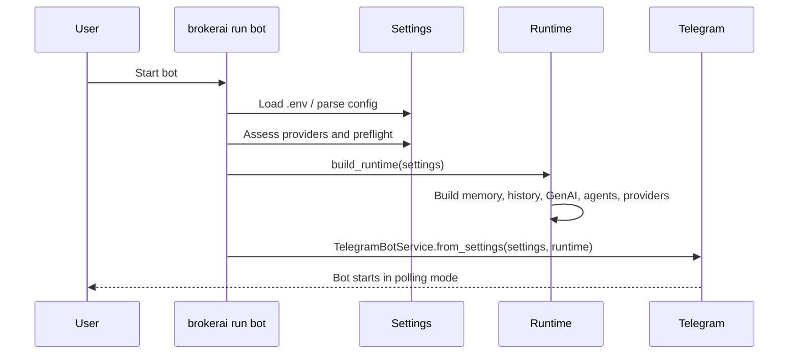
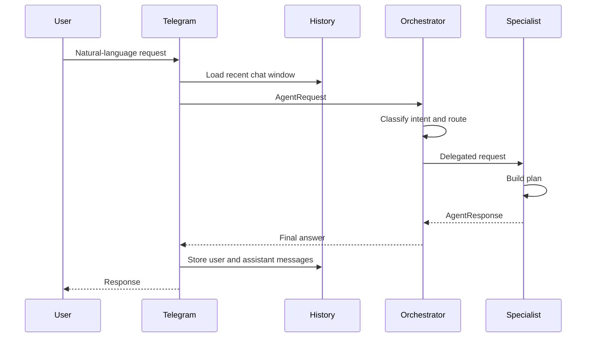
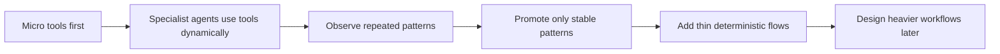
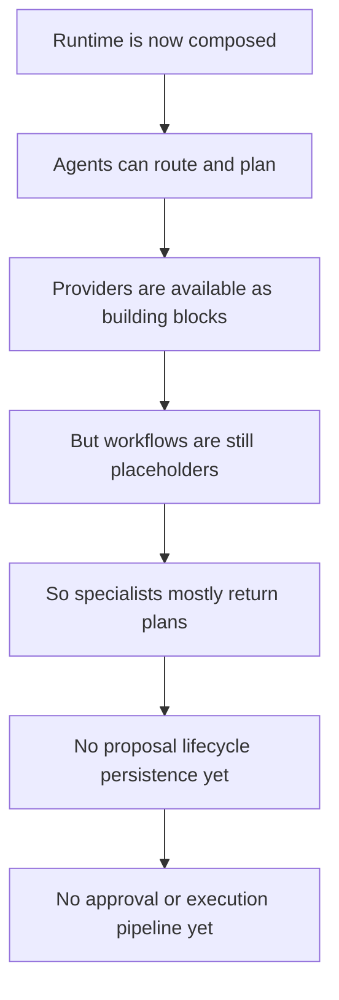
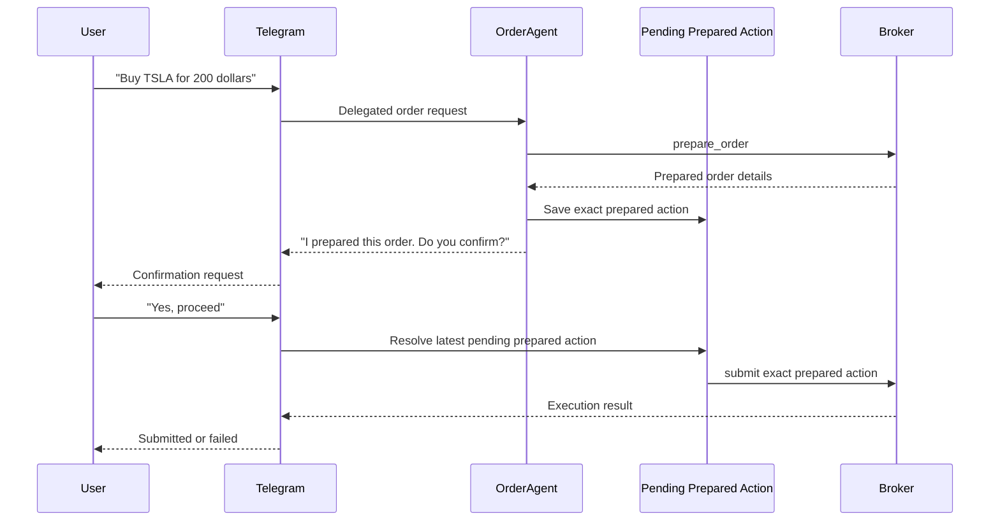
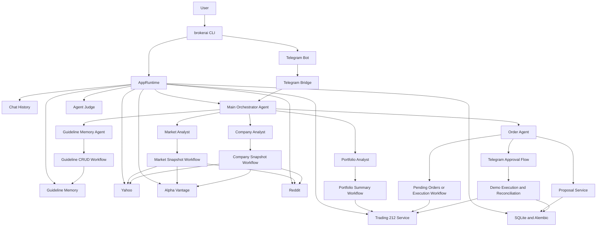
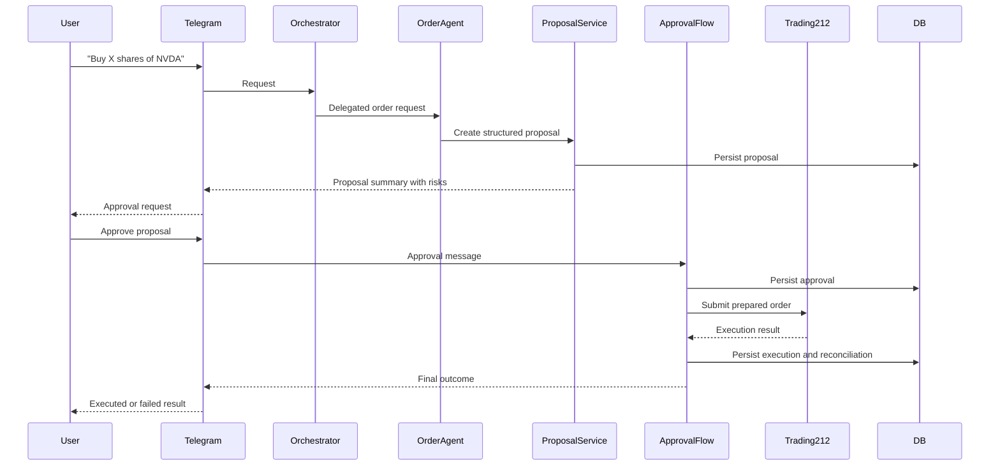

# Architecture Diagrams

These diagrams complement [ARCHITECTURE_STATUS.md](./ARCHITECTURE_STATUS.md).

Mermaid fits this repo well because it stays plain-text, version-controlled, and readable inside Markdown.

## 1. Current High-Level Architecture

## 2. Current Wiring Reality

## 3. Current Startup Flow

## 4. Current Request Flow

## 5. V1 Delivery Strategy

## 6. Current Limitation

## 7. V1 Execution Safety Model

## 8. Target Architecture

## 9. Execution Flow Target

## Suggested Use

Use this file together with:
- [ARCHITECTURE_STATUS.md](./ARCHITECTURE_STATUS.md) for the written summary
- [PLAN.md](./PLAN.md) for the roadmap

The next useful diagrams would be:
- one diagram per real workflow once implemented
- proposal lifecycle state transitions
- approval and reconciliation state transitions
