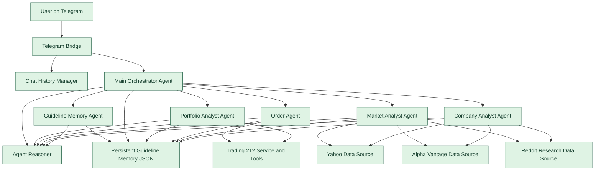
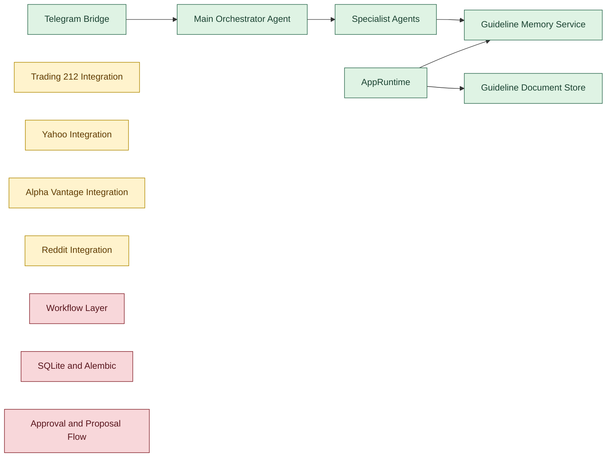
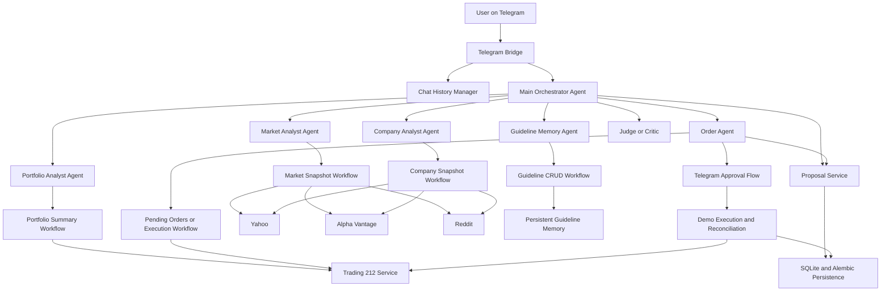
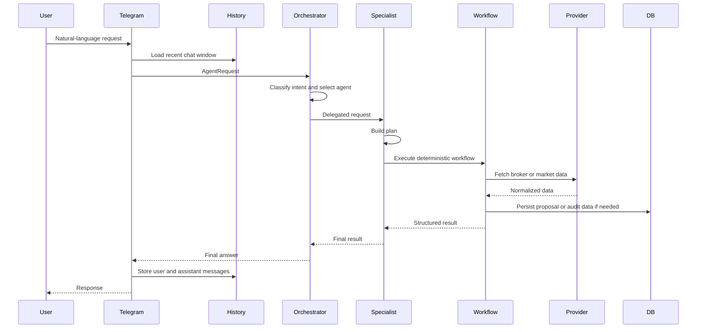
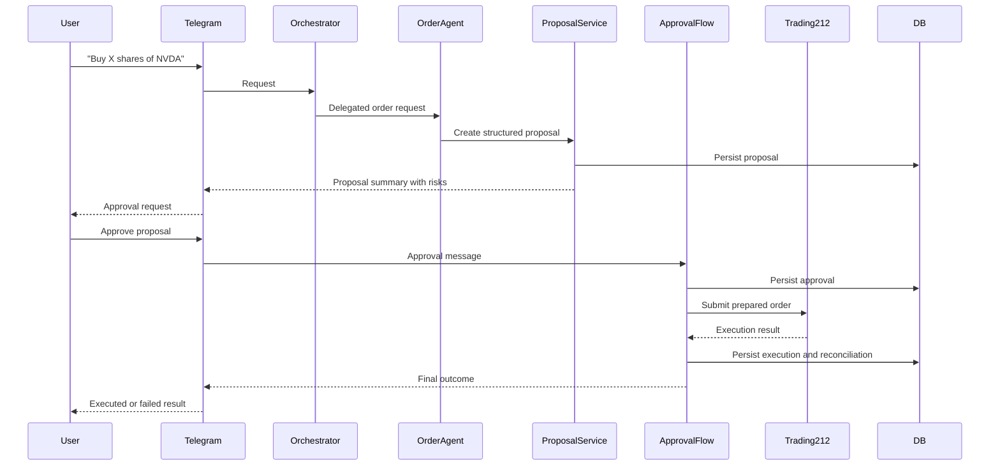
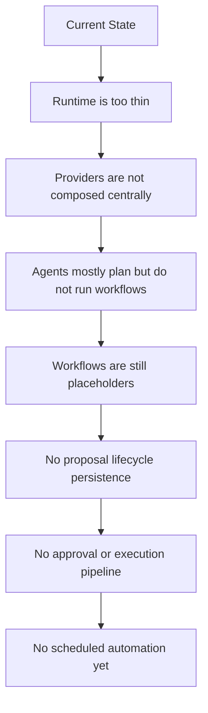

# Architecture Diagrams

These diagrams are meant to complement [ARCHITECTURE_STATUS.md](./ARCHITECTURE_STATUS.md).

Mermaid is a good fit here:
- it works well for flowcharts
- it supports sequence diagrams
- it stays version-controlled as plain text inside Markdown

## 1. Current High-Level Architecture

## 2. Current Wiring Reality

## 3. Target Architecture

## 4. Target Request Flow

## 5. Execution Flow Target

## 6. Main Gaps

## Suggested Use

Use this file together with:
- [ARCHITECTURE_STATUS.md](./ARCHITECTURE_STATUS.md) for the written summary
- [PLAN.md](./PLAN.md) for the target roadmap

If useful, the next step can be a more operational set of diagrams:
- one diagram per workflow
- one diagram per runtime service
- one diagram for proposal and approval state transitions
