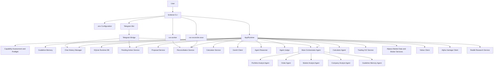
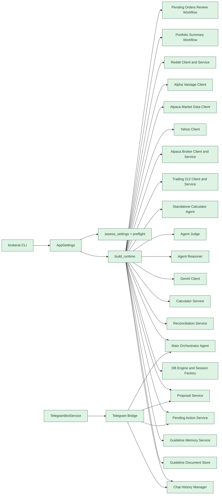
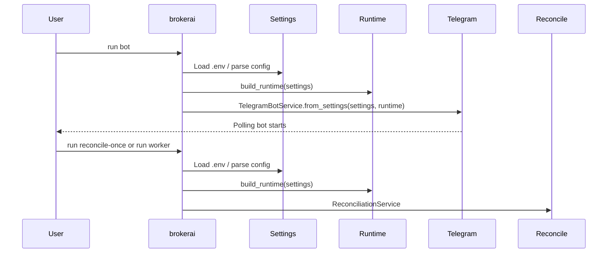
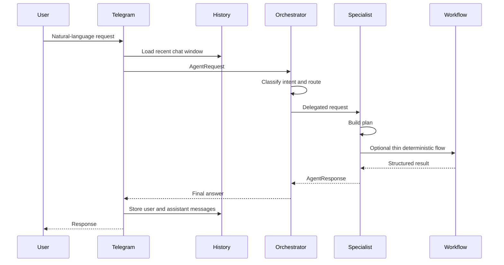
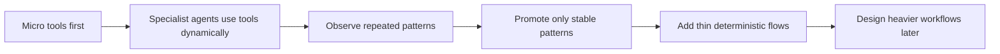
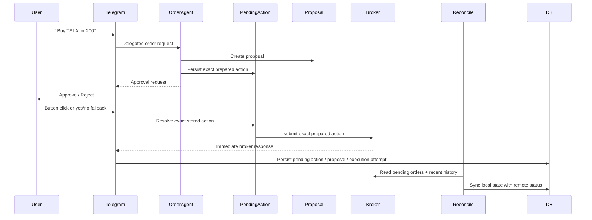
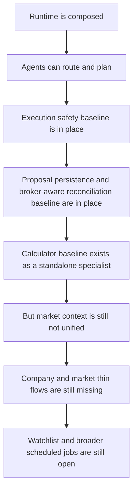
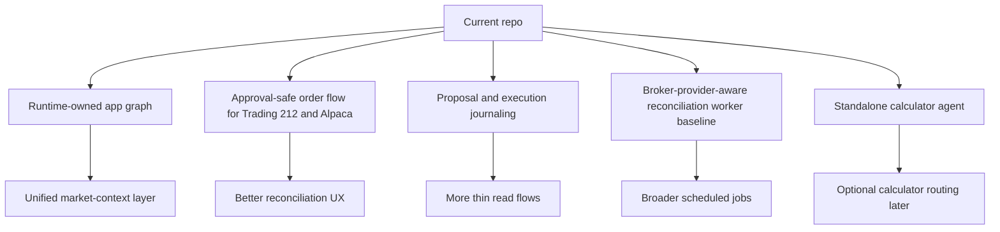

# Architecture Diagrams

These diagrams complement [ARCHITECTURE_STATUS.md](./ARCHITECTURE_STATUS.md).

Mermaid fits this repo well because it stays plain-text, version-controlled, and readable inside Markdown.

## 1. Current High-Level Architecture

## 2. Current Wiring Reality

## 3. Current Startup And Worker Surfaces

## 4. Current Request Flow

## 5. V1 Delivery Strategy

## 6. Current Execution And Reconciliation Flow

## 7. Current Limitation

## 8. Current Vs Near-Term Direction

## Suggested Use

Use this file together with:
- [ARCHITECTURE_STATUS.md](./ARCHITECTURE_STATUS.md) for the written summary
- [PLAN.md](./PLAN.md) for the roadmap

The next useful diagrams would be:
- one diagram per real workflow once implemented
- market-context provider arbitration
- watchlist and scheduled-job flows
